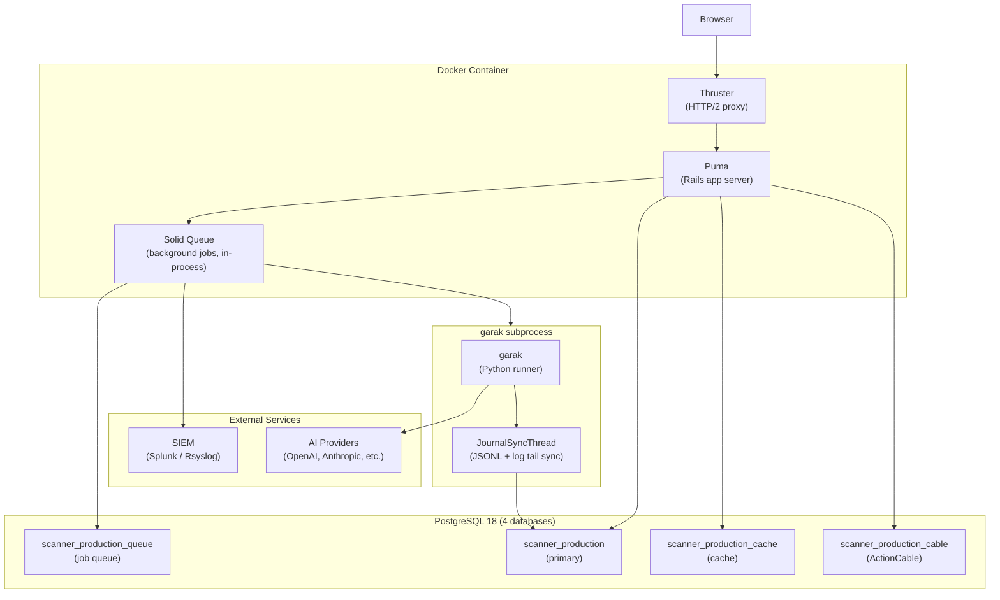

# Architecture

## Component Overview



## Key Design Decisions

### Single-Process Architecture

Puma and Solid Queue run in the same container process. This simplifies deployment — a single Docker container runs everything except PostgreSQL. The tradeoff is that you can't scale the web server and job workers independently.

### garak as a Subprocess

[NVIDIA garak](https://github.com/NVIDIA/garak) is a Python library. Scanner invokes it as a separate process so Python dependency management stays isolated from the Rails app and garak can run with its own environment.

The `RunGarakScan` service class starts `script/run_garak.py` and passes the report UUID plus execution-log path. The Python runner writes JSONL progress to disk while `JournalSyncThread` syncs progress into `raw_report_data` and bounded execution-log tails into `report_debug_logs`. When processing completes, `Reports::Process` promotes final logs into `report_debug_logs.logs`; `Report#logs` remains a compatibility accessor for existing Rails callers.

Pending, starting, running, and processing report pages show Activity Stream automatically for authenticated users. The mounted lease controller refreshes a short Rails-cache watcher lease, and `BroadcastReportDebugJob` polls watched active reports and publishes Turbo Stream updates when the rendered debug payload changes. Select **View activity** to expand timeline entries, the raw JSONL tail, and execution logs. Terminal reports can still expose final execution logs with the optional `?debug=true` troubleshooting fallback.

### Multi-Database PostgreSQL

Rails 8's multi-database support splits concerns across four databases:

| Database | Purpose |
|---|---|
| `scanner_production` | Application data (targets, scans, reports, users) |
| `scanner_production_queue` | Solid Queue job tables |
| `scanner_production_cache` | Rails cache store |
| `scanner_production_cable` | Action Cable subscription data |

This improves isolation and allows different retention/backup policies per database.

### Multi-Tenancy

Scanner uses [acts_as_tenant](https://github.com/ErwinM/acts_as_tenant) for row-level multi-tenancy. Every company's data is scoped to their tenant in all queries. Encrypted fields use per-tenant keys derived from `SECRET_KEY_BASE`.

:::important
All code that accesses encrypted fields must run within a tenant scope:
```ruby
ActsAsTenant.with_tenant(company) { ... }
```
Controllers handle this automatically. Background jobs must do it explicitly.
:::

### Encryption at Rest

Sensitive fields are encrypted using ActiveRecord Encryption:

| Model | Encrypted Fields |
|---|---|
| `Target` | `json_config`, `web_config` |
| `EnvironmentVariable` | `env_value` |

Encryption keys are derived per-tenant from `SECRET_KEY_BASE` via HMAC. See `config/initializers/active_record_encryption.rb`.

## Extension Points

See [Extension Points](./extension-points) for the full API. The three extension points are:

- **`Scanner.configure`** — service class overrides and lifecycle hooks
- **`BrandConfig.configure`** — branding and theming
- **`ProbeSourceRegistry`** — additional probe data sources

## Technology Stack

| Layer | Technology |
|---|---|
| Framework | Ruby on Rails 8 |
| Database | PostgreSQL 18 |
| Background jobs | Solid Queue (in-process with Puma) |
| Frontend | Stimulus + Turbo (Hotwire), Tailwind CSS |
| AI Scanner | NVIDIA garak (Python) |
| Auth | Devise |
| HTTP proxy | Thruster (HTTP/2, asset compression) |
| Containerization | Docker |
